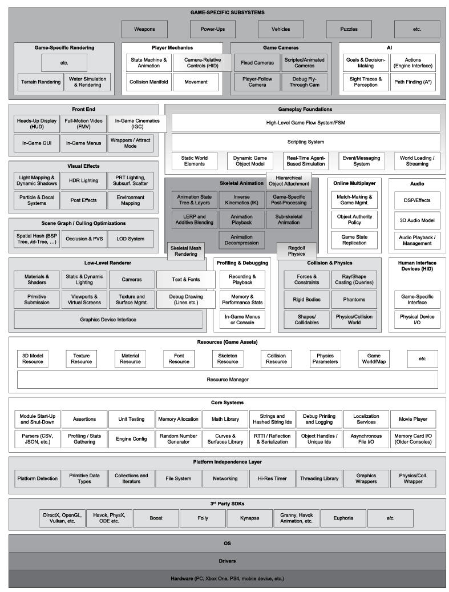

# Chapter 1 Introduction

Most two- and three-dimensional video games are examples of what computer scientists would call *soft real-time interactive agent-based computer simulations*.

### FPS

First-person shooters typically focus on technologies:

- Effect rendering of large 3D virtual worlds;
- A response camera control/ aiming mechanic
- High-fidelity animations of the player's virtual arms and weapons
- A wide range of powerful handled weaponry
- A forgiveing player character motion and collision model, which often gives these games a "floaty" feel
- High-fidelity animations and artificial intelligence for the non-player characters (NPCs)—the player’s enemies and allies; and

### Fighting Games

Fighting Games are typically two player games involving humanoid characters pummeling each other in a ring of some sort

The definition of this games on wiki: [Fighting_game](http://en.wikipedia.org/wiki/Fighting_game)

The techinology which the games focused on is that:

- A rich set of fighting animations;
- Accumulate hit detection
- A user input system capable of detecting complex button and joystick combination
- **Crowds, but otherwise relatively static backgournds**

The 3-D fighting games technology was focused on:

- High  definition character graphics
- Realistic skin shaders with subsurface scattering and sweat effects
- photo-realistic lighting and particle effects
- High-fidelity character animations
- Physics-based cloth and hair simulations for the characters

### Racing Games

Racing game encompasses all games whose primary task is driving car/vehicle or other some of track

### Strategy games

The Modern strategy games was arguably by *Dune II: The Buildding of a Dynasty*. In this genre, the player deploys the battle units in his/ her arsenal strategically across a large playing field in an attempt to overwhelm his or her opponent.

Using the grid-based word construction to build the world is the better way to achieve games.

Some other common practices in strategy games include the following techniques:

- Each unit is relatively low-res, so that the game can support large numbers of them on-screen at once.
- Height-field terrain is usually the canvas upon which the game is designed and played.
- The player is often allowed to build new structures on the terrain in addition to deploying his or her forces
- User interaction is typically via single-click and area-based selection of units, plus menus or toolbars containing commands, equipment, unit types, building types, etc.

### Massively Multiplayer Online games

The massively multiplayer online game gerne is typified by games like Guild Wars 2 , etc.

An MMO is defined as any game that supports huge numbers of simultaneous players, usually all playing in one very large, present virtual world.

## Runtime Engine Architecture

---

A game engine generally consists of a tool suite and runtime components.

### Target Hardware

The target hardware layer represent the computer system or console on which the game will run.

The typical platforms include Microsoft Windows, Linux and Mac-OS;The mobile platform like the iOs and Android systems. The game consoles like XBOX and Sony PlayStation, and Nintendo's DS GameCube.

### Device Drivers

Device drivers are low-level software components provided by the operating system or hardware vendor. Drivers manage hardware resources and shield the operating system and upper engine layers from the details of communicating with the myriad variants of hardware devices available.

### Operating System

The operating system is running all the time. It orchestrates the execution of multiple programs on a single computer, one of which is your game.

 On early consoles, the operating system, if one existed at all, was just a thin library layer that was compiled directly into your game executable. On those early systems, the game “owned” the entire machine while it was running. However, on modern consoles this is no longer the case.

### Third-Party SDKs and Middleware

Most game engines leverage a number of third-party software development kits and middleware.

The functional or class-based interface provide by an SDK is often called application programming interface(API).

#### Data Structures and Algorithms

Like any software system, a games depend heavily on *container* data structures and algorithms to manipulate them.

Some third-party provide the special data structure :

- *Boost*. Boost is a powerful data structures and algorithms library, designed in the style of the standard C++ library and its predecessor, the standard template library(STL).
- *Folly.* Folly is a library used at Facebook whose goal is to extend the standard C++ library and Boost with all sorts of useful facilities, with an emphasis on maximizing code performance.
- *Loki.*  Loki is a powerful generic programming template library which is exceedingly good at making your brain hurt!

##### The C++ Standard Library and STL

 The C++ standard library also provides many of the same kinds of facilities found in third-party libraries like Boost. The subset of the standard library that implements generic container classes such as std::vector and std::list is often referred to as the standard template library (STL), although this is technically a bit of a misnomer: The standard template library was writ ten by Alexander Stepanov and David Musser in the days before the C++ language was standardized.

#### Graphics

Most game rendering engines are build on top of a software interface library such as following:

- *Glide* is the 3D graphics SDK for the old Voodoo graphics cards. This SDK was popular prior to the era of hardware transform and lighting which began with DX7
- *OpenGL* is a widely used portable 3D graphics SDK.
- *DirectX* is Microsoft’s 3D graphics SDK and primary rival to OpenGL
- *libgcm* is a low-level direct interface to the PlayStation 3’s RSX graphics hardware, which was provided by Sony as a more efficient alter native to OpenGL.
- Vulkan is a low-level library created by the Khronos™ Group which enables game programmers to submit rendering batches and GPGPU compute jobs directly to the GPU as command lists, and provides them with f inegrained control over memory and other resources that are shared between the CPU and GPU. (See Section 4.11 for more on GPGPU programming.)

### Collision and Physics

Collision detection and rigid body dynamics are provide by the following well-known SDKs:

- *Havok* is a popular industrial-strength physics and collision engine.
- *PhysX* by NVIDIA is another excellent collision and dynamics engine.

### Animation

Any game that has organic or semi-organic charaters needs an animation system.

There are five basic types of animation used in games:

- sprite/texture animation,
- rigidbodyhierarchy animation,
- skeletal animation,
- vertex animation, and
- morph target

### Human Interface devices

Every game needs to process input from the player. obtained from various *human interface devices* (HIDs) including:

- the keyboard and mouse,
- a joypad, or
- other specialized game controllers.

 The HID engine component is sometimes architected to divorce the low level details of the game controller(s) on a particular hardware platform from the high-level game controls. It massages the raw data coming from the hard ware,introduce in gadead zone around the center point of each joypads tick,debouncing button-press inputs, detecting button-down and button-up events, interpreting and smoothing accelerometer inputs (e.g., from the PlayStation  Dualshock controller) and more. It often provides a mechanism allowing the player to customize the mapping between physical controls and logical game functions. It sometimes also includes a system for detecting chords (multiple buttons pressed together), sequences (buttons pressed in sequence within a certain time limit) and gestures (sequences of inputs from the buttons, sticks, accelerometers, etc.)

### Audio

Audio is just a important as graphics in any game engine. But compared with the rendering, physics and animation, audio gets less attention than others.

Audio engine vary greatly in sophistication.

### Online Multiplayer/Networking

Many games permit multiple human players to play within a single virtual world. Multiplayer games come in at least four basic flavors:

- *Single-screen multiplayer*
- *Split-screen multiplayer*
- *Networkded multiplayer*
- *Massively multiplayer online games(MMORPG)*

Multiplayer games are quite similar in many ways to their single-player conuterparts. However support for multiple players can have profound impact on the design of certain game engine components.

The game world object model, renderer, humaninputdevicesystem, playe rcontrol systemand animation systems are all affected. Retrofitting multiplayer features into a pre-existing single-player engine is certainly not impossible, although it can be a daunting task.

---

### Runtime Engine Architecture

A game engine generally consist of a tool suite and runtime compoment. 

The figure above this line  is a typical game engine layers.

### Target Hardware

The target hardware layers represents the computer system or console on which the game will run. Typical platforms include Microsoft Windows, Linux and Mac-OS-based PCs; mobile platforms like the Apple iPhone and iPad, Android smart phones and 

### Devices Drivers

Devices drivers are low-level software components provided by the operating system or hardware vendor. Drivers manage hardware resources and shield the operating system and upper engine layers from the details of communicating with the myriad variants of hardware devices available.

### Operating System

On a PC, the operating system is running all the time. It orchestrates the execution of multiple programs on a single computer, one of which is your game.

Operating system like Microsoft Windows employ a time-sliced approach to sharing

### Third-Party SDKs and Middleware

Most game engines leverage a number of third-party software development kits(SDKs) and middleware, as shown at behind figure. The functional or class-based interface provided by an SDK is often called an application programming interface (API). We will look at a few examples.

#### Data Structure and Algorithms

Like any software system, games depend heavily on container data structures and algorithms to manipulate them.

There a some examples of 3rd-party libs which provide these kinds of services:

- Boost.  Boost is a powerful data structures and algorithms library, **designed in the style of the standard C++ library and its predecessor, the standard template library (STL)**. (*The online documentation for Boost is also a great place to learn about computer science in general*!)
- Folly. Folly is a library used at Facebook whose goal is to extend the standard C++ library and Boost with all sorts of useful facilities, with an emphasis on maximizing code performance.
- Loki
